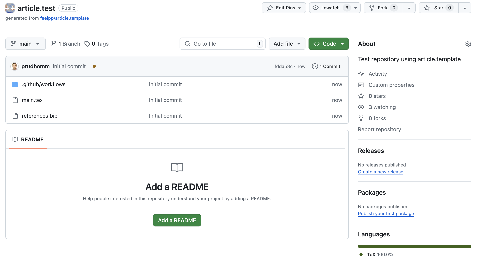

= Template Repository for Articles
Christophe Prud'homme
:!figure-caption:
:version: v1.4.0

[.author]
Christophe Prud'homme::
Cemosis, Institut de Recherche Mathématique Avancée, UMR 7501 Université de Strasbourg - CNRS
email: christophe.prudhomme@cemosis.fr

.Zenodo DOI
--
image::https://zenodo.org/badge/DOI/10.5281/zenodo.13224368.svg[DOI, link=https://doi.org/10.5281/zenodo.13224368]
--

.GitHub Information
--
image:https://img.shields.io/github/v/release/feelpp/article.template[GitHub Release]
image:https://img.shields.io/github/actions/workflow/status/feelpp/article.template/latex.yml[GitHub Actions Workflow Status]
image:https://img.shields.io/github/downloads/feelpp/article.template/total[GitHub Downloads (all assets, all releases)]
--

== Introduction

Writing scientific articles using LaTeX offers numerous advantages, including precise typesetting, seamless integration of references, and robust version control. 
This template repository demonstrates best practices for organizing LaTeX projects, utilizing GitHub Actions for automated document compilation, managing bibliographies with Zotero, and optimizing image handling. 
By following this template, researchers can enhance their workflow efficiency and ensure consistent document formatting across platforms like Overleaf and local LaTeX installations.
The releases assets produced by the GitHub Actions allows to upload the article to HAL, arXiv, Zenodo, etc.

== How to cite

If you use this template, please cite it as follows:

.Chicago style
[source]
----
Christophe Prud'homme. “Feelpp/article.template: Release V1.4.0”. Zenodo, August 5, 2024. https://doi.org/10.5281/zenodo.13224368.
----

.BibTeX
[source,bibtex]
----
@software{christophe_prud_homme_2024_13224368,
  author       = {Christophe Prud'homme},
  title        = {feelpp/article.template: Release v1.4.0},
  month        = aug,
  year         = 2024,
  publisher    = {Zenodo},
  version      = {v1.4.0},
  doi          = {10.5281/zenodo.13224368},
  url          = {https://doi.org/10.5281/zenodo.13224368}
}
----

== Image Naming Convention

To ensure compatibility with platforms like HAL, arXiv, and Overleaf, name your images with the `img-*` prefix and store them in the same directory as the `.tex` file. This makes it easier to manage and upload your images along with your LaTeX document.

Example::
+
- `img-figure1.pdf`
- `img-figure2.png`
- `img-figure3.jpg`

== Using References from Zotero via Overleaf

To manage your references with Zotero and integrate them seamlessly into Overleaf, follow these steps:

1. Export Zotero Library to BibTeX
   - Open Zotero and select the references you want to export.
   - Go to `File > Export Library`.
   - Choose `BibTeX` as the format and save the file (e.g., `references.bib`).

2. Upload BibTeX File to Overleaf
   - Open your project in Overleaf.
   - Click on the `Upload` button (top-left corner) and upload your `references.bib` file.

3. Include the Bibliography in Your LaTeX Document
   Add the following lines to your `.tex` file to include the bibliography:
+
[source,latex]
----
\documentclass{article}
\usepackage{graphicx}
\usepackage{natbib}
\begin{document}

% Your content here

\bibliographystyle{plainnat}
\bibliography{references}

\end{document}
----
4. Cite References in Your LaTeX Document
Use the `\cite{}`` command to cite references within your document. For example:
+
[source,latex]
----
As shown by \citet{AuthorYear}, this method is effective.
----

== GitHub Action Workflow for LaTeX Compilation

The GitHub Action workflow :
. compiles a LaTeX document 
. uploads the resulting PDF
. creates a release with the PDF as an asset when a new tag is pushed of the type `v*`, eg `v1.0.0` or a pre-release `v1.0.0-preview.1`

To create a git tag, do the following:
[source,bash]
----
git tag -a v1.0.0 -m "Version 1.0.0"
git push origin v1.0.0
----

== Steps to Use the Template Repository

Create a New Repository:: Use the git template repository feature to create a new repository based on this template.
+

Clone the Repository:: Clone the repository to your local machine.
+
[source,bash]
----
git clone https://github.com/feelpp/my-repo.git
cd my-repo
----
+

Add Your LaTeX Source Files:: Place your .tex file and image files (img-*.pdf, img-*.png, img-*.jpg) in the repository.

Commit and Push Changes:: Commit your changes and push them to the repository.
+
[source,bash]
----
git add .
git commit -m "Add initial LaTeX document and images"
git push origin main
----
+
The GitHub Action workflow will automatically compile your LaTeX document and upload the resulting PDF as an artifact. You can download the compiled PDF from the Actions tab in your repository.

== Overleaf Integration

Sync GitHub Repository with Overleaf::	
. In Overleaf, create a new project and select Import from GitHub.
. Connect your GitHub account and select the repository you want to sync.
. The sync will trigger the workflow and compile your LaTeX document in GitHub.

Update References from Zotero::
. Periodically export your references from Zotero to references.bib and push the updated file to your GitHub repository.
. Overleaf will automatically sync the changes, ensuring your references are up to date.
